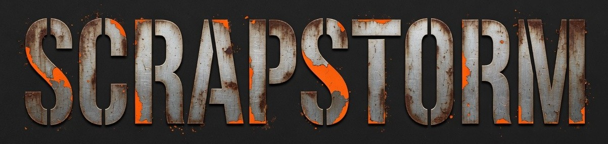
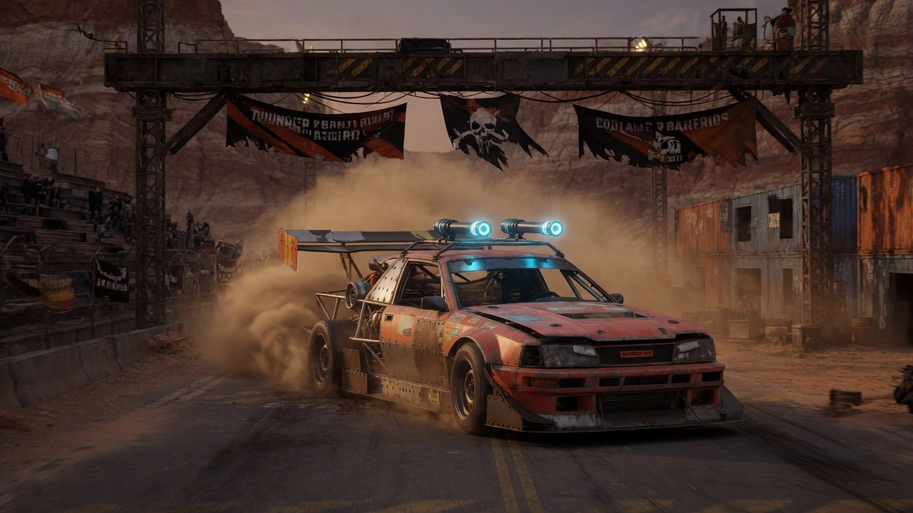
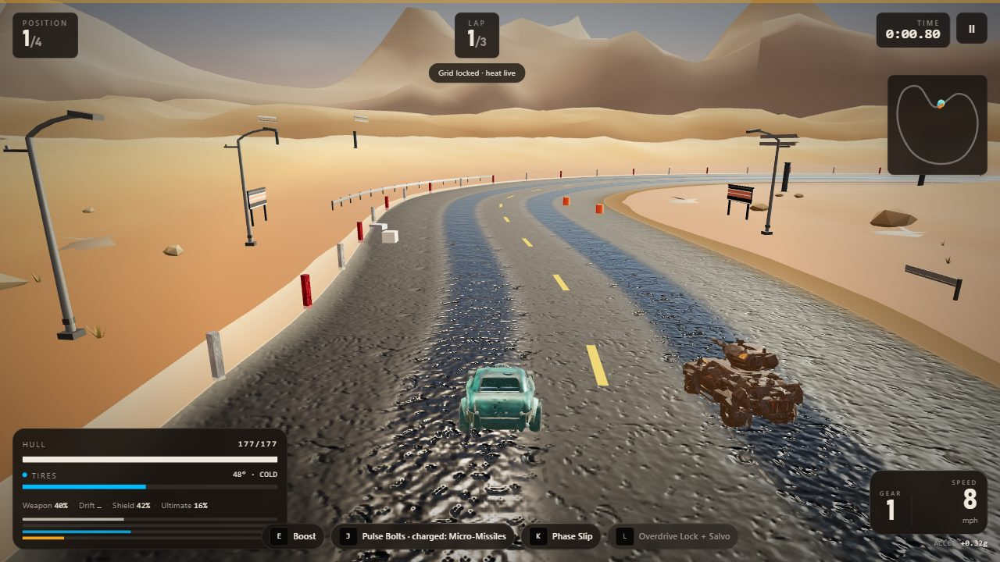
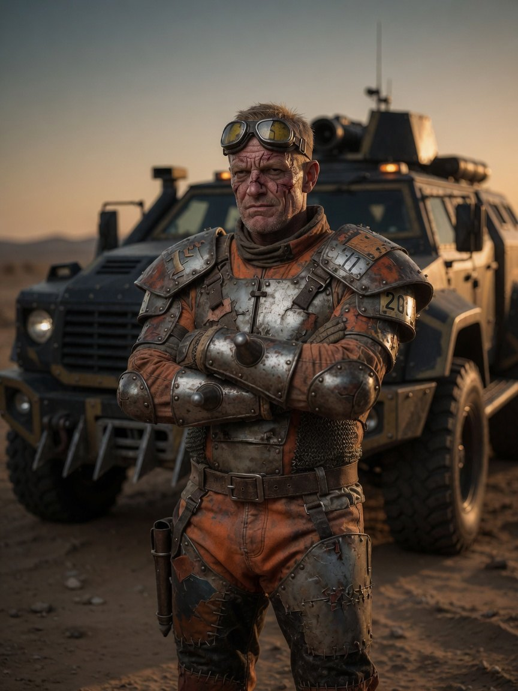
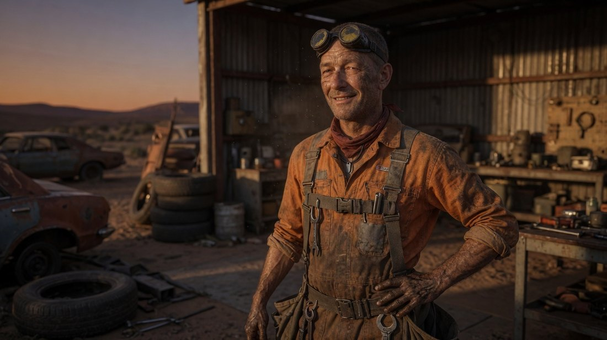
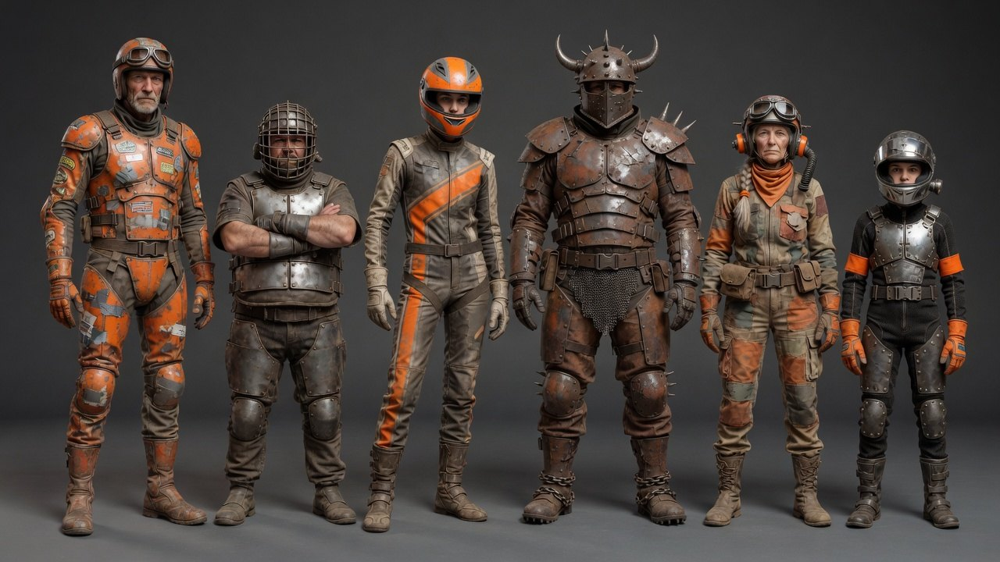
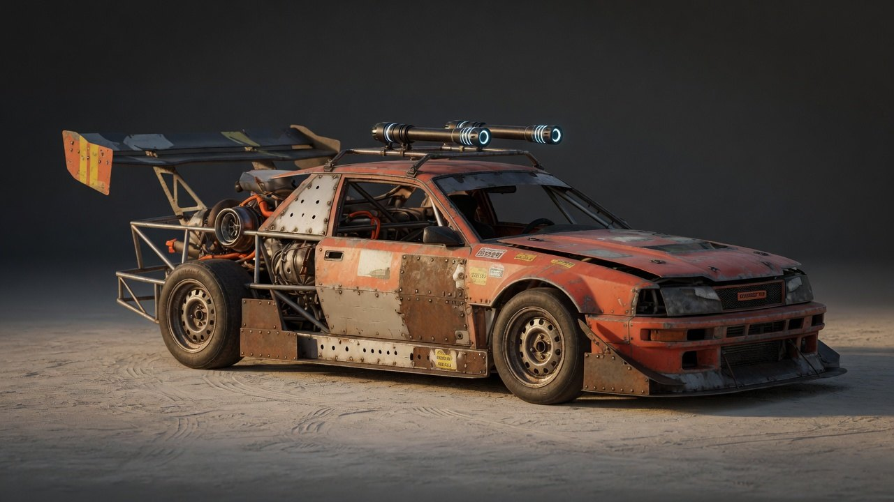

<p align="center">
  
</p>

<h1 align="center">Scrapstorm League</h1>

<p align="center">
  <strong>Drift. Draft. Dent the legend.</strong><br>
  A browser combat racer. Need for Speed: Most Wanted (2005) if the fight was the point.
</p>

<p align="center">
  <a href="LICENSE"></a>
  <a href=".github/workflows/ci.yml"></a>
  <a href="https://huggingface.co/datasets/Sadegh97/scrapstorm-assets"></a>
  
  
</p>

<p align="center">
  
</p>

Eighteen months ago Marrow put you into the flare stack and kept your car. The Scrapline is fifteen rivals long. Take it back.

This repository is **source only**. Meshes, textures, HDRIs, audio, UI, and cutscene video live on Hugging Face so a clone stays small. There is no hosted demo and no paid cloud. You run it locally.

| | |
|---|---|
| **Code** | [MohammadSadeghSalehi/scrapstorm](https://github.com/MohammadSadeghSalehi/scrapstorm) |
| **Assets** | [Sadegh97/scrapstorm-assets](https://huggingface.co/datasets/Sadegh97/scrapstorm-assets) |
| **Stack** | React 19, Three.js r185, TanStack Start, WebGL2 |
| **Mode** | Single-player heats. Three classes. Six circuits. A fifteen-rival career. |

<p align="center">
  
</p>

---

## Cast

<p align="center">
  
  &nbsp;
  
</p>

**Marrow** is rank 1. He drives the car that used to be yours. **Bex** rebuilt you a hull out of two dead ones and a grudge. The rest of the grid is the Scrapline: six visors you can tell apart at 200 mph.

<p align="center">
  
</p>

---

## Classes

<p align="center">
  
</p>

| Class | Wins by | Pays with |
|---|---|---|
| **Interceptor** | Speed, reach, cadence | Thin hull. Loses every ram. |
| **Bruiser** | Mass, attrition, off-road | Understeer. Lowest Vmax. |
| **Trickster** | Rotation, mines, decoys | Middling at everything it does not own. |

Hold fire until the weapon meter fills and the next shot comes out as ordnance.

---

## Requirements

- **Node.js 22+**
- **Git**
- Chrome or Edge (WebGL2). Firefox works. Safari is untested.
- About **1.5 GB** disk for `node_modules` plus the asset pack (~420 MB)
- Optional: Python 3.10+ with `huggingface_hub` (the fetch script uses it)

A discrete GPU helps. Playable on a laptop 5080-class chip at medium/high. Integrated GPUs should stay on low/medium.

---

## Run it

### 1. Clone the code

```bash
git clone https://github.com/MohammadSadeghSalehi/scrapstorm.git
cd scrapstorm
```

### 2. Install Node dependencies

```bash
npm ci
```

If `npm ci` fails (no lockfile match), `npm install` is fine.

### 3. Fetch the art pack from Hugging Face

The dataset is public. No token required.

```bash
pip install -U huggingface_hub
node scripts/fetch-assets.mjs
```

This writes into `public/assets/` (meshes, textures, HDRIs, audio, UI, video). Those folders are gitignored on purpose. Re-run the script any time; matching hashes are skipped.

Shortcut after clone:

```bash
npm run setup
```

### 4. Start the dev server

```bash
npm run dev
```

Open **http://localhost:8080**. The first request can take 10–40 seconds of Vite transform. Wait for the menu, then Continue career or Quick heat.

### 5. Play

| Key | Action |
|-----|--------|
| W | throttle |
| S | brake / reverse |
| A D | steer |
| Shift | drift |
| E | boost |
| J | fire |
| K | defense |
| L | ultimate |
| P / Esc | pause |
| ` | graphics debug (in a race) |

---

## Optional

**Production build, still local:**

```bash
npm run build
npm run preview
```

**Regenerate music and voice** (not required to play). Needs your own ElevenLabs key in a gitignored `.env`:

```bash
cp .env.example .env
# ELEVENLABS_API_KEY=...
node scripts/gen-music.mjs
node scripts/gen-vo.mjs
```

**Headless gates** (no browser, no GPU):

```bash
npm run typecheck
npm run bench:smoke
```

---

## Secrets

Do not commit API keys. `.env` is gitignored. `.env.example` is empty placeholders only.

Runtime play does **not** need ElevenLabs, xAI, or Hugging Face tokens. The public asset pack is enough.

If you upload assets you need a **write** Hugging Face token in the environment (`HF_TOKEN`), never in the tree. Rotate any token that has been pasted into chat or a shell history.

CI greps the source for leaked `hf_`, `sk-`, `xai-`, and GitHub PATs.

---

## Layout

```
src/game/            simulation, physics, combat, missions (no three.js)
src/game/world/      renderer
src/components/game/ HUD, menus, loading
scripts/             asset fetch, smoke tests, generators
benches/             LLM eval harness
docs/github/         README stills (not runtime assets)
public/assets/       restored by fetch-assets.mjs, not in git
AGENTS.md            how to change this codebase without lying
```

The sim must stay renderer-free. That is what makes the smoke tests and the benchmark possible.

---

## Scrapstorm-Bench

`benches/` scores models on a real-time 3D game, not a toy canvas. A black canvas at 160 fps is a fail.

| Track | Status | What it is |
|---|---|---|
| **A** Regression | **Runs today** | Headless gates. `npm run bench:smoke`. Same set in CI on every push to `main`. |
| **B** Agent tickets | Specified, not frozen | Git tags `bench/Txx-*`, a failing tree, a player-visible spec, hidden tests. Not added until those tags are frozen. |
| **C** One-shot / few-shot | Specified | From a 2–3 page spec to a playable combat racer, or this repo minus one subsystem. Oracles: `tsc`, a lap in `GameSimulation`, a non-black Playwright still. |

See [`benches/README.md`](benches/README.md).

---

## License

Source: MIT. Third-party art: see `NOTICE` and `public/assets/SOURCES.md` after you fetch the pack.

Concept stills in `docs/github/` and `refs/` are original to this project.
